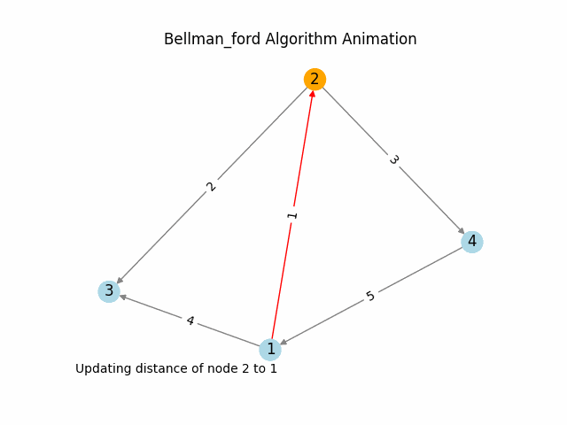

# Bellman-Ford Algorithm

Bellman-Ford Algorithm is used to find the shortest paths from a single source vertex to all other vertices in a weighted graph. It can handle graphs with negative weight edges.

## How to use

The `run_algorithm` function in `bellman_ford.py` can be used to run Bellman-Ford Algorithm on a given graph. It returns the shortest distances from the start node, the shortest path tree, and the steps for visualization.
 ## Results

    