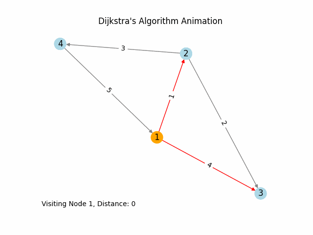

# Dijkstra's Algorithm

## Overview
Dijkstra's algorithm finds the shortest path from a start node to all other nodes in a graph.

## Graph Data Format
The graph data is stored in `example_graph.csv` with the following columns:
- `start`: The starting node of the edge.
- `end`: The ending node of the edge.
- `weight`: The weight of the edge.

## Usage
1. Ensure you have the required dependencies: `pip install -r requirements.txt`.
2. Run the algorithm using `main.py` or directly from root repository folder:
   ```bash
   python ../../main.py
   ```

## Results
The algorithm traverses the graph in a certain order:

